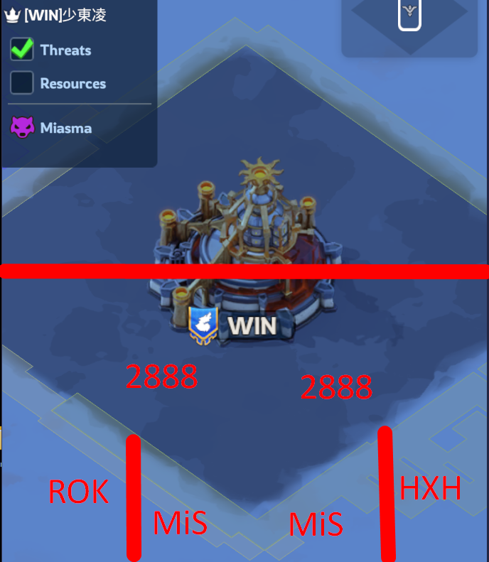
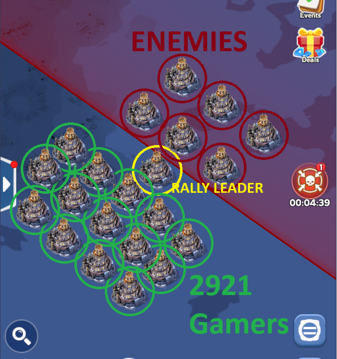

# 🌑 **FULL-SCALE WAR – QUICK GUIDE**

## **“FULL SCALE WAR _IS_ FULL SCALE WAR”**

## **PRIMARY STRATEGY: BURN 2888 FIRST — CASTLE LATER**

---

# ⚠️ **IMPORTANT NOTES (READ FIRST!)**

### ✅ **Do NOT go to the castle before 12:00 UTC.**

Wait for the **ALL CLEAR** from leaders.

### ✅ **Your FIRST and ONLY objective at the start:**

🔥 **Burn 2888 cities.**
Not the castle. Not anything else.

### ✅ **Teleport to your rally leader.**

Use **Advanced Teleport** if needed.

### ✅ **Stay in tight formation — max 4 cities wide.**

We must leave room for other alliances.

### ✅ **If weak: shield + reinforce allies.**

Your job is support, not solo fighting.

### ✅ **Join rallies instantly.**

### ✅ **Speed matters — open with solo attacks.**

Our top 10–20 players will **solo their whales and strongest cities**.
Everyone else should quickly **solo targets of equal or lower FC/power**.
Fast hits at the start will break their frontline before rallies even land.

Non-stop pressure = victory.

---

# ⚔️ **1. Alliance Positioning**

We are fighting **behind enemy lines** in the ⚫ **GREY ZONE** ⚫.
Alliances involved: **ROK – MIS – HXH**

Our objective in this zone is **NOT the castle** — it is to **destroy 2888’s fighting power**.

---

# 🧭 **2. First-Minute Strategy**

### 🔥 Rally Leaders

- Position **near the RED zone** or as close as possible to **2888 clusters**.
- Maintain a **4-city-wide line** to allow allied support.

- 😡 Cities IN RED: ENEMIES
- ⭐ City in Yellow - Rally leader
- 💚 2921 Gamers!

### 🔥 Everyone Else

- **Teleport directly to your rally leader’s location.**
- If you are weaker: **shield in the grey zone** and **reinforce burning allies**.
- **Join rallies immediately** — no delays.

### 🎯 Goal

Burn every 2888 city so they **cannot fight in the castle battle**.

---

# 👁️‍🗨️ **3. Tactical Coordination**

### 📍 Team Vision

- Our alliances form a **front line** behind rally leaders.
- **Targets directly in front** of each alliance.
- **Zantas** handles precision hits on priority targets.
- If we run out of cities: **support other alliances** in burning the rest.

### 📍 Communication

We will coordinate in real time to:

- Shift target clusters
- Focus big whales together
- Adjust rally timing
- Maintain pressure nonstop

---

# 🔥 **Final Reminder**

**BURN 2888 FIRST.**
**Castle comes second.**
**Stay tight, follow leaders, and keep the pressure constant.**

---

# 🛑 **SORRY MESSAGE**

We are sorry for keeping things from you for so long.
We’ve had **moles inside our ranks** — not spies from 2888, but **fellow 2921 members leaking information**.
Because of this, we could not reveal our full plans earlier.
We simply couldn't risk 2888 sniffing out what we were preparing.

---

### 📜 **Message from Spaikius to all MiS members**

I want to apologize for lying to you and causing confusion.
The message I sent about “with agreeing on 2888” was **different for every MiS member** — it was part of a test to identify the mole.

I **do have suspicions** about who it is, but without solid proof, I cannot take action.
So for now, I must stay quiet.

And to the **mole** who actually took the bait:
You got lucky this time.
Even the worst of us are sometimes blessed by fortune.
