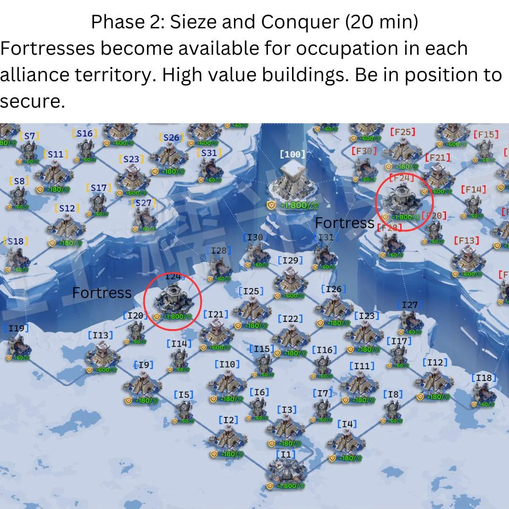

## 🏰 **Canyon Clash — Guide**

---

### ⚙️ **Preparation**

✅ **Everyone sign up** with your **3 strongest hero sets**

- **Squad 1:** All 3 heroes **attack-focused**
- **Squad 2:** All 3 heroes **defense-focused**
- **Squad 3:** Whatever you’ve got — **best leftover heroes**
- 🐉 **Combat buffs and pets** work — use them for an edge
- ⚡ **March speed-ups** are allowed and **super useful**
- 🔙 If a building has **5 squads waiting in queue**, you can **retreat your squad** to an adjacent **friendly or enemy building**
- ❤️ If your march is in an **uncontested building**, click it → **“Conscript”** to instantly heal your troops
  > 🔸 Much better than letting them die and respawn

---

### ⚔️ **Phase 1 — Early Game (First ~17 min)**

🗺️ Quickly **occupy all neutral buildings** in your territory  
🛡️ **Defend bridges and chokepoints** — these are the main entries  
🎯 If possible, **steal a few enemy buildings** for an early point lead  
⚠️ **Don’t overextend!**

**🩸 Teamwork wins Canyon — not solo heroics!**

> Keep defenses solid or we’ll get overrun. Hold your ground, play smart 💪

---

### 🏯 **Phase 2 — Fortress War (Next ~20 min)**

🔥 **Fortresses unlock** — these generate **massive points**  
🏰 **Hold your own fortress at all costs**  
🚩 If you can, **capture one enemy fortress** — holding **two** gives a near-guaranteed win  
👥 Have players **waiting at adjacent buildings** so we can **instantly occupy** the fort when it opens

🧱 **Fortresses are control hubs:** whoever holds them usually **controls the battlefield flow**

---

### 👑 **Phase 3 — Citadel Onslaught (Final ~20 min)**

🏆 The **center (Citadel)** opens! There are **10–11 guards** —  
the **march that defeats the final guard** gets **first control** 🥇  
This is **super important** because it’s **hard to take it back** once captured.

---

#### ❌ If We **Don’t Control** the Center

🚫 Stop sending random marches to the middle  
✂️ **Cut off** the alliance holding the center — each territory has **one key building** that blocks their path to the middle  
⚔️ Once they’re cut off → **push the center** and take control  
⚔️ Or capture their **Fort!**

> The **Citadel** and **Forts** give the **same points**, so **either one** can swing the battle.

---

#### ✅ If We **Do Control** the Center

🔒 Don’t let yourself get **cut off**  
♻️ Keep **rotating marches** so the Citadel is never empty  
🏠 Still **defend your other holdings** — losing territory means losing points

---

### 🧠 **Cheat Sheet — Focus the Middle & Defend Smart**

- 🎯 **Focus on the middle of the map first** — the central **Citadel** and **Fortresses** both give **1,800 pts/min**.
  > Securing even **one** from the enemy can **guarantee victory before endgame**.
- 🚧 **Avoid overextending** — only defend your side territories. Pushing too deep exposes your main line.
- 🛡️ **Hold your side defenses** — controlling **adjacent or helper buildings** supports the middle and protects flanks.
- 🔙 If a building has **5 squads waiting**, **retreat** to a nearby friendly or enemy building to keep fighting.
- 🌀 **Don’t clog the hub!** If **10 players** are already inside a building, **move to another one** — flank, cut reinforcements, or harass enemy routes.

---
