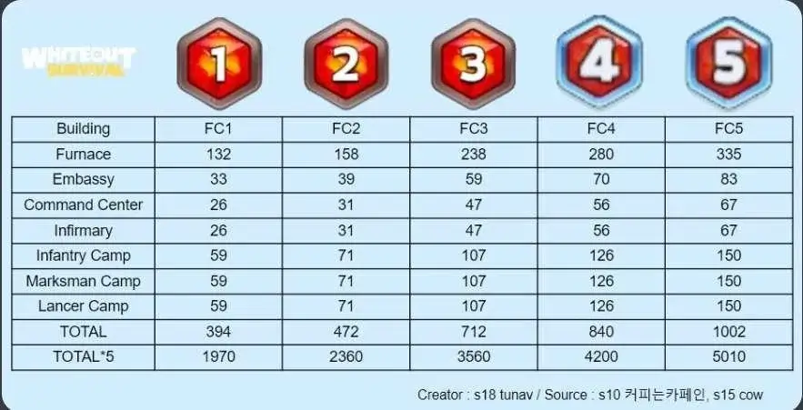
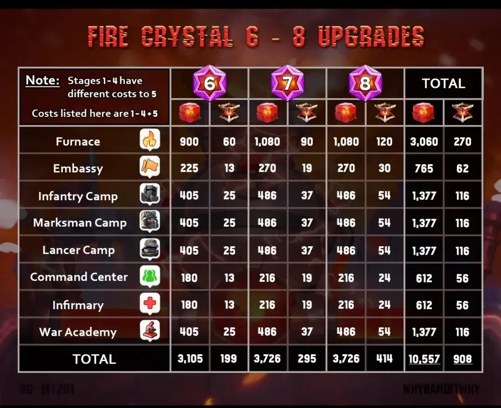
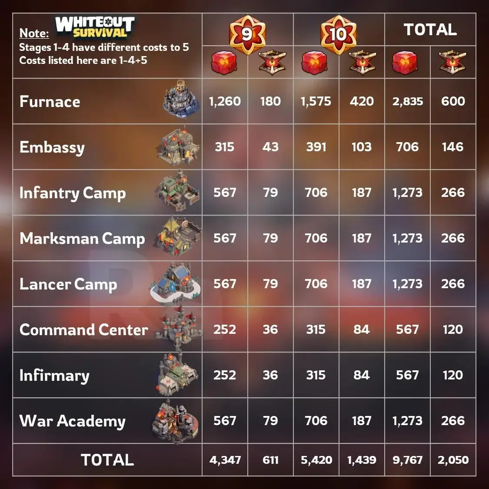

# 🧊 Fire Crystal & Research Guide

---

## 🔥 **1. Fire Crystals (FC)**

**Used for:** FC building upgrades (Troop Camps, War Academy, Furnace)  
**Spike:** Costs rise massively from **FC6+**

**Key Points**

- Prioritize **Troop Camps → War Academy → Furnace → Others**.
- Save FC early — **RFC starts being required later**.
- Use **Crystal Lab** daily for efficient conversions.

---

## ⚙ **2. Refined Fire Crystals (RFC)**

**Used for:** High-tier FC upgrades (FC6+).  
**Bottleneck:** Major limiter in mid-late game.

**Key Points**

- Start collecting **before** you reach FC6.
- Spend RFC only on high-impact upgrades:
  - **Troop Camps**
  - **War Academy**
- Avoid wasting RFC on low-value buildings.
  - **Infirmary**
  - **Embassy**
  - **Command Center**

---

## 🧩 **3. Fire Crystal Shards (FCS)**

**Used for:** **War Academy Research** (not buildings).  
**Cost:** Thousands → **30k+** for full advanced research (T11 + final nodes).

**Key Points**

- Shards are separate — they **don't replace** FC/RFC.
- Research only during SvS Prep phase, use your research / General speed ups
- Map your research route — don't scatter upgrades. Research only one troop type at the time
  - Infantry -> Marksman -> Lancer
  - Infantry -> Lancer -> Marksman
- Converting too much steel will drain you fast.
  - Never go bellow 2m steel

---

## 🧠 **4. Research Advice (War Academy)**

- **Unlock all T11 troop types first**
  (Do not invest in the final 3 nodes)
- **Save your steel** — convert only what you can afford.
  - Keep **~2M steel** minimum
  - Steel → shard rate: **5,000 steel → 1 shard**,
- **FC → Shards conversion** is okay **only** if you have FC overflow.

  - Up to 200 FC/day → **10 FC → 13 shards**

- Don't convert FC aggressively — you'll need FC/RFC for buildings.
- Research costs for a single Helios troop type:
  - 13,405 Fire Crystal Shards
  - 3,985,000 Steel
  - Base research time: 270 days.
  - Research time with buffs (85% base) + State buff (10%) + Vice president buff (10%): 132 days.
- 👉 **[War Academy Calculator](https://wostools.net/war-academy-calculator)**

---

## 🧭 **5. Progression Flow**

### **Early → Mid Game**

1. Push key buildings with FC
2. Start building RFC reserves before FC6
3. Begin early research with shards

### **Mid → Late Game**

4. Spend RFC only on high-impact upgrades
5. Focus shards on T11 unlocks → troop power nodes
6. Keep FC buffer so you don't stall at higher FC levels

---

## 📝 **6. TL;DR Quick Priorities**

- **FC:** Spend carefully — needed later.
- **RFC:** Main late-game blocker — start saving them as soon as you can
- **Shards:** Prioritize **T11 unlocks → key troop upgrades**.
- **Steel:** Don't drain it; keep **>2M**.
- **Goal:** Advance **buildings + research + troops** together without starving any resource.

