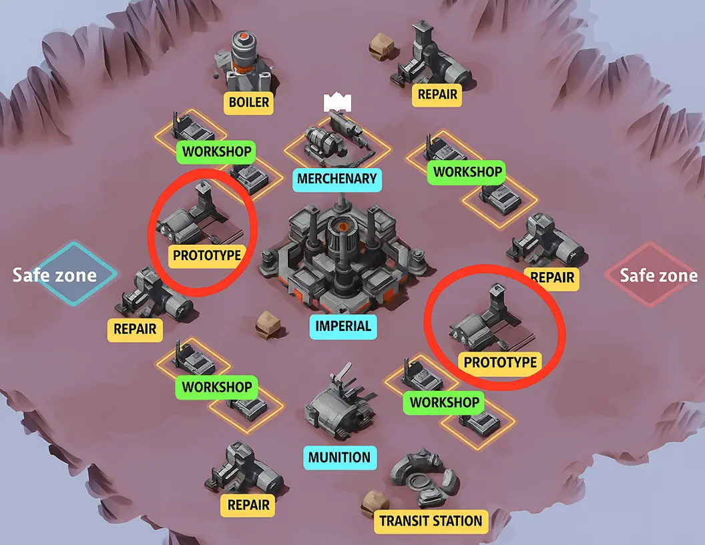
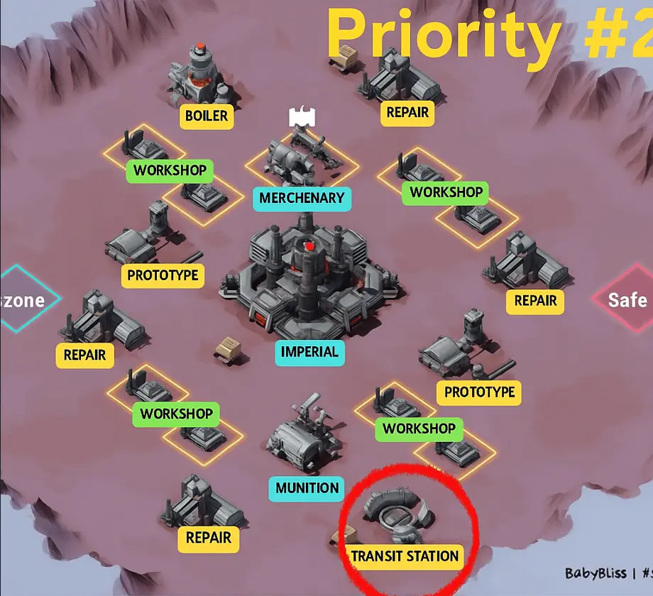
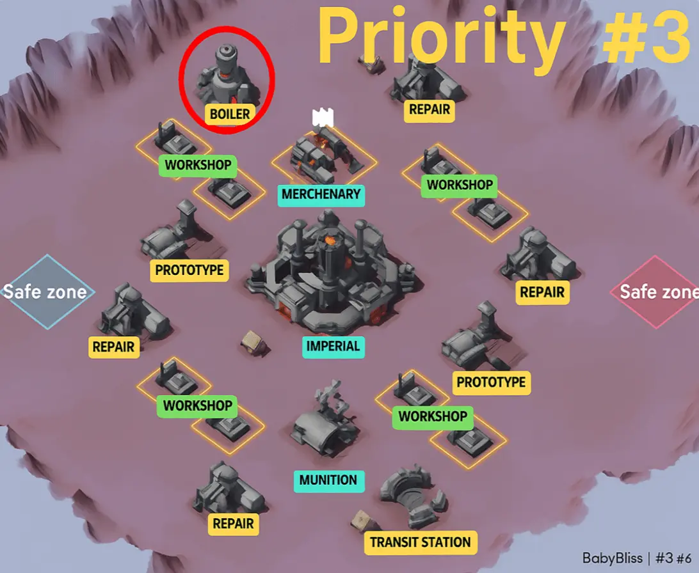
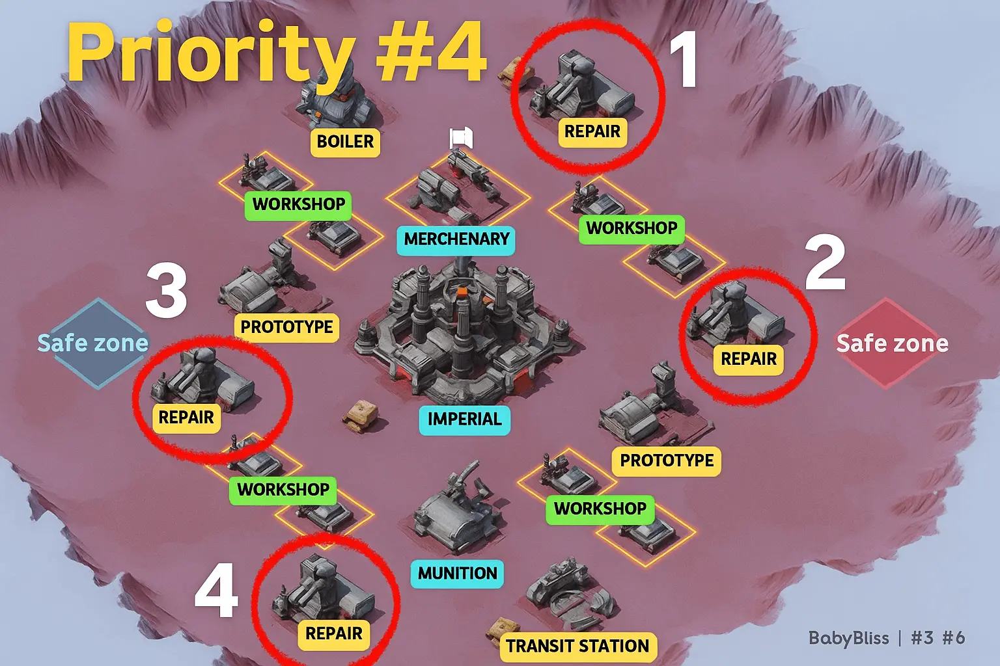

# 🏭 **Foundry Battle Strategy Guide**

---

## ⚡ **TL;DR (Quick Summary)**

- 🏆 **Only ALLIANCE Arsenal Points decide victory**
  - Personal points = rewards only (MVP ≠ win)
- ⏱️ Foundry lasts **1 hour** and has **3 phases**
- 🎯 **Top Priorities:**
  1️⃣ **Prototype I & II** — _2,400 AP/min combined_ (**= 4 Repair Sites**)  
  2️⃣ **Imperial Foundry** — _1,800 AP/min (Phase 2+)_

👉 **Holding both Prototypes + Imperial = 4,200 AP/min**

- 🔒 Secure **Prototypes first**, then Imperial, then Repairs
- 💣 **Weapon Workshops** appear **randomly in Phase 3 (30mins)** (2 waves, huge points = 100k!)
  - 👀 **Assign scouts to scan the map every 1-2 minutes**
  - 📣 **Immediately post Workshop locations in Squad Chat**
- 🚫 This is the **only event** where Healing Speedups should be used  
  _(tap healing is disabled)_
- 🐉 **Combat buffs & pets work**
- 🕒 You may **leave up to 12 min** and rejoin with **healed troops**

---

## ⏱️ **Battle Phases (VERY IMPORTANT)**

### 🟢 **Phase 1 — Opening (Start → 15 min)**

Unlocked:

- 🧪 Prototype I & II
- 🛠️ 4× Repair Facilities
- 🔥 Boiler Room
- 🚉 Transit Station

🎯 **Goals:**

- Secure **first control bonuses**
- Lock down **both Prototypes**

---

### 🟡 **Phase 2 — Mid Game (15 min+)**

Unlocked:

- 🏛️ **Imperial Foundry**
- 💣 Munition Warehouse (combat buff)
- ⚔️ Mercenary Camp (strike teams)

🎯 **Goals:**

- Immediately secure **Imperial Foundry**
- Shift strongest players to **Imperial + Prototypes**

---

### 🔴 **Phase 3 — End Game (~30 min+)**

Unlocked:

- 💥 **Weapon Workshops**

  - Appear **randomly**
  - Spawn in **2 waves**
  - Each gives **~4,000+ AP**

🎯 **Goals:**

- Constantly **scan the map**
- Capture workshops **the moment they appear**
- These can **decide the winner**

> ⚠️ No system notification — map awareness wins here.

---

## ⚔️ **Quick Strategy Summary**

### 🧪 **1️⃣ Secure and Defend Both Prototype Buildings (TOP PRIORITY)**

- **2,400 AP/min total**
- Equal to **four Repair Facilities**
- Losing a Prototype is **devastating**
- Keep **strong garrisons at all times**

---

### 🛠️ **2️⃣ Capture and Hold at Least One Repair Facility**

- **+600 AP/min**
- Provides early stability
- Can be **sacrificed later** for Imperial if needed

---

### 🏛️ **3️⃣ Secure Imperial Foundry Immediately (Phase 2)**

- Opens at **~15 min**
- **Drop a Repair** if required — Imperial is worth it
- **Imperial + Prototypes = 4,200 AP/min**
- Reinforce with your **strongest players**

---

### 💣 **4️⃣ Weapon Workshops (Phase 3 Swing Factor)**

- Spawn **randomly**, no alert
- Appear in **two waves**
- Each grants **massive burst points**
- Assign players to **map-watch duty**

---

### 🎯 **5️⃣ Bait and Strike (Scattered Points Tactic)**

- Let enemies **stack points** in buildings
- Clear them at peak value
- When a building flips → **points scatter**
- 🚨 Watch **yellow dots** on the mini-map
- **Teleport and collect FAST**

---

## ⏱️ **Critical Timing: First Control Points**

> 🕐 _Imperial, Munition, Mercenary_
> ⛔ **Cannot be captured before ~15 minutes**

At ~15 min:

- Strongest players **transfer garrisons**
- Others hold early buildings
- Core team **teleports mid**
- Secure **Imperial Foundry FIRST**

---

## 🎯 **First Control Priority Order**

1. 🧪 **Prototype** — 1,200 AP/min
2. 🏛️ **Imperial Foundry** — 1,800 AP/min
3. 🛠️ **Repair Facility** — 600 AP/min
4. 🔥 Boiler / 🚉 Transit / ⚔️ Merc / 💣 Munition — 240 AP/min

---

## 🛡️ **Defense & Reinforcement Strategy**

- Garrison **Prototypes & Imperial** with top power
- Reinforce allies under attack
- **Defensive kills matter**
- Reinforce weaker allies to **bait enemy losses**
- Always use **Counter-Recon**

---

## 💥 **Scattered Points Awareness**

> ⚠️ Scattered points can WIN or LOSE Foundry

- Buildings drop **huge point piles** when flipped
- Yellow dots = **free points**
- Late-game scatters are often **decisive**

---

## 🎭 **Bait-and-Clear Strategy**

> 🧠 _Punish greed_

- Leave some buildings intentionally
- Let enemies accumulate points
- Clear → collect scatters
- ⚠️ If no one attacks your building, assume they're waiting

---

## 📊 **Alliance Arsenal Points Table**

| Building         | First Control | Occupation  | Notes                   |
| ---------------- | ------------- | ----------- | ----------------------- |
| 🏛️ **Imperial**  | 9,000 AP      | +1,800 /min | Core win condition      |
| 🧪 **Prototype** | 6,000 AP      | +1,200 /min | Highest priority        |
| 🛠️ **Repair**    | 3,000 AP      | +600 /min   | Stable income           |
| 🔥 **Boiler**    | 1,200 AP      | +240 /min   | Faster control          |
| 🚉 **Transit**   | 1,200 AP      | +240 /min   | −50% teleport cooldown  |
| ⚔️ **Mercenary** | 1,200 AP      | +240 /min   | Strike teams            |
| 💣 **Munition**  | 1,200 AP      | +240 /min   | +15% damage & reduction |

> 🏆 **Point Priority:** > **Imperial → Prototype → Repair → Everything else**

---

